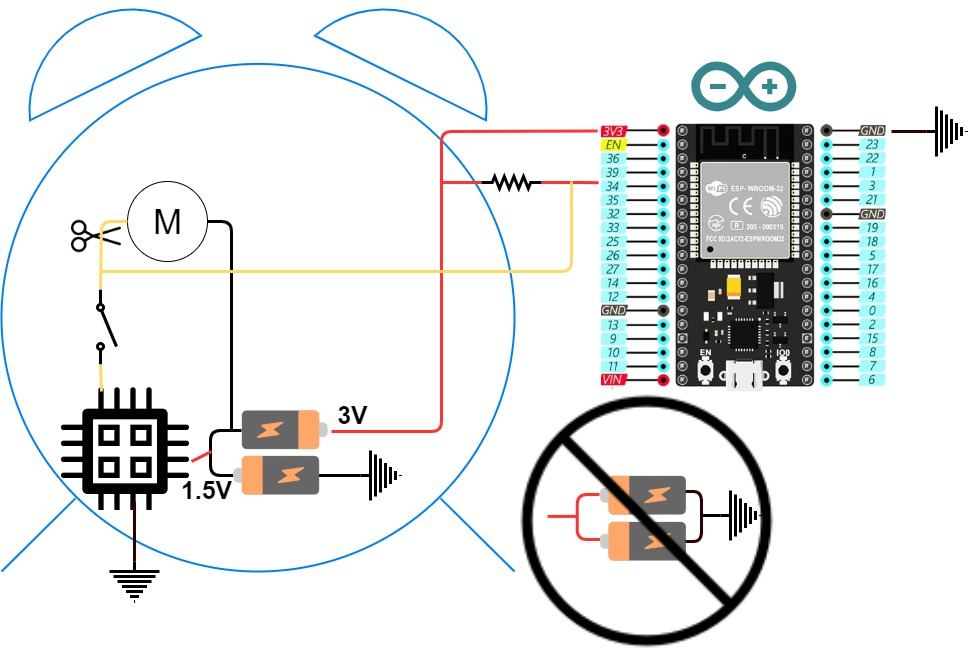

# BuzzClock
MQTT publishing Alarm Clock\
Use a regular alarm clock with motor and bell and an ESP32 for this project.\

## Software description
The ESP is set to deep sleep at all times and wakes up on one of following three conditions, taking stated actions:
### 1. The Alarm is activated
* Connect to Wifi
* Connect to MQTT Server
  * publish topic *BuzzClock* with payload *buzz*
* Schedule a timed wakeup in 60 minutes
* Go to sleep. All further alarms during this time will be ignored
### 2. Battery is connected
* Connect to Wifi
* Connect to MQTT Server
  * publish topic *BuzzClock* with payload "wake"
  * publish topic **BuzzClock/Battery* with payload being the battery percentage
* Activate wakeup on Alarm
* Schedule a timed wakeup in 24h
* Go to sleep
### 3. Timed wakeup
* Connect to Wifi
* Connect to MQTT Server
  * publish topic **BuzzClock/Battery* with payload being the battery percentage
* Activate wakeup on Alarm
* Schedule a timed wakeup in 24h
* Go to sleep

## Schematics
Using D34 with a pull-up resistor to 3.3V. This could really be any IO.
When the IO goes low the controller wakes up and publishes its message.

## Modifying the IKEA Dekad Alarm Clock
For this project I have used the IKEA Dekad Alarm Clock. It has plenty of space inside and only a few modifications need to be done. The most important is the battery which consists of two AA batteries in parallel. This supplies only 1.5V and is not enough for the ESP which requires at least 2.5V to operate.

Hardware Mods:
* Convert the battery pack to work in series.\
  The default layout of the battery is a connection in parallel. Rearanging it means we will drive the clock itself only fron one of the batteries, connecting it between the two cells. The ESP itself will be powered from "the whole pack" being our modified connection in series. I modified my holder by cutting and soldering to maintain the original compartment with no cosmetical change.
* Cut the trace to or remove the motor all together\
  This is up to you. In my case I did not want the buzzer to be connected so I removed the motor
* Add a pull-up resistor\
  On the ESP32 connect from the power supply a wire to the pin used for the ISR. Set currently to DI34 in the code.
* Connect the clock circuit board to the ESP\
  The built in board acts as a switch when the alarm is active connecting the motor output to ground. Connect this cable which went previously to the motor now to the same pin on the ESP connected to the pull-up resistor
* Power the ESP\
  Connect the ESP to ground and 3V pads on your newly modified battery

